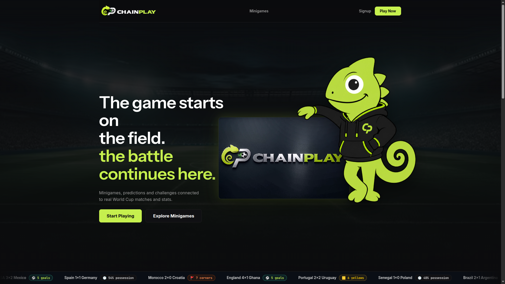
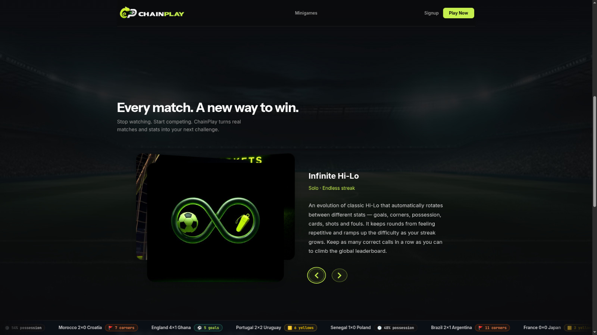
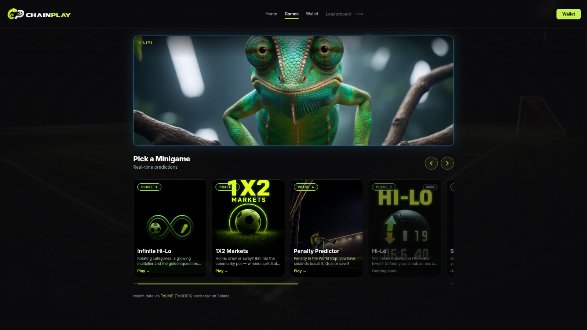
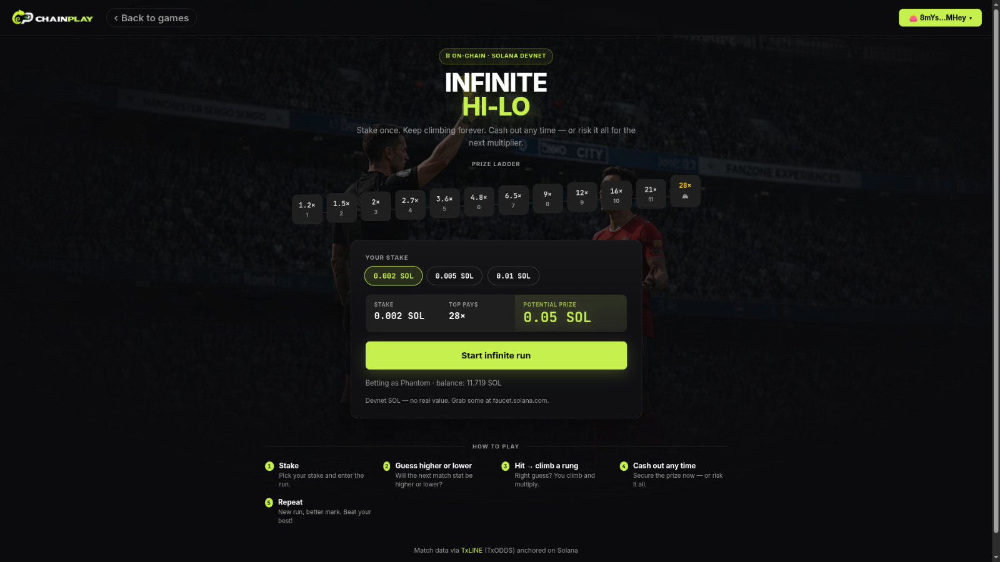
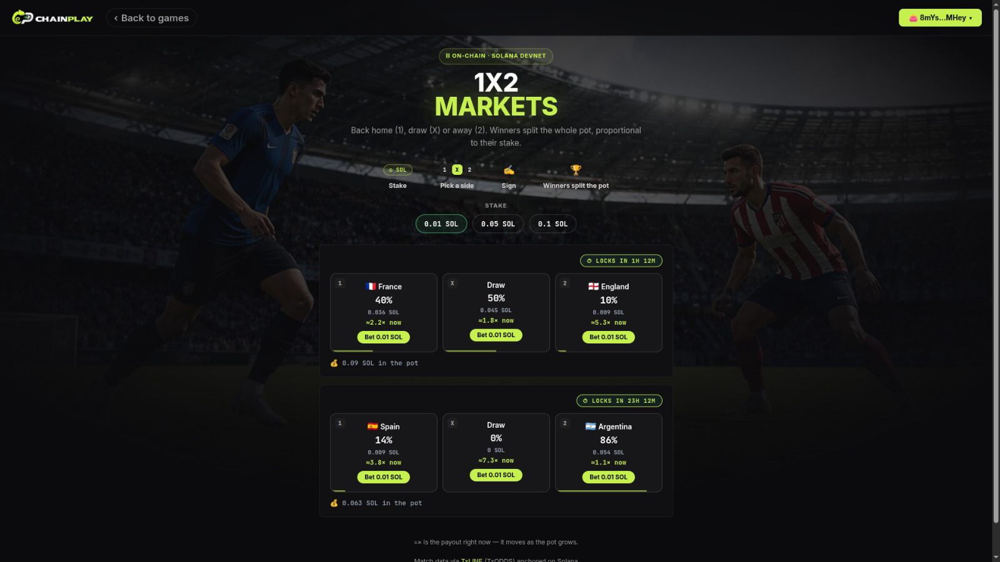

<p align="center">
  
</p>

<p align="center">
  <b>Football minigames with on-chain betting on Solana, powered by real World Cup data from the TxLINE API.</b><br/>
  Every prediction becomes a verifiable transaction. Every bet mints an <b>NFT ticket</b> that redeems the prize.
</p>

<p align="center">
  
  
  
  
</p>

<p align="center">
  <a href="docs/README.md"><b>📚 Project Wiki</b></a> — the games, the TxLINE integration, the Solana program, security &amp; the full docs index
  ·
  <a href="docs/technical-integrations.md"><b>📐 Technical Deep Dive</b></a>
</p>

<p align="center">
  
</p>
<p align="center">
  
  
</p>

---

## 1. The idea

ChainPlay turns live World Cup statistics into fast, bettable minigames: the player
predicts goals, corners, cards, ball possession or the outcome of a match, and the
server checks the prediction against real data coming from **TxLINE**. Every bet is
settled by our own Solana smart contract (`oddies_bet`, devnet), which escrows the
funds, determines the winner from the data supplied by the backend (acting as oracle)
and pays out the prize with no manual intervention.

The combination of **verifiable sports data (TxLINE)** + **on-chain settlement
(Solana)** is the core of the product: players don't have to trust the platform to
know their prediction was graded correctly — the data comes from a third-party
provider and the payout is public and auditable on-chain.

Three games are already playable (hub at `#/jogos`):

| | Game | What it is | Route |
|---|---|---|---|
|  | **Infinite Hi-Lo** | Compare stats (goals, corners, possession, cards) match after match — higher or lower — climbing a multiplier ladder with every correct call, cash out anytime. | `#/hilo-infinito` |
|  | **1X2 Markets** | Parimutuel betting on the outcome (home/draw/away) of upcoming World Cup matches; the pot is split among the winners. | `#/mercados` |
|  | **Penalty Predictor** | Lightning mode: predict goal or save on penalty kicks, with a short timer and streak multipliers. | `#/penalty` |

<p align="center">
  
  
</p>
<p align="center">
  <sub><b>Infinite Hi-Lo</b> — stake once, climb the multiplier ladder, cash out anytime · <b>1X2 Markets</b> — live parimutuel pots on real fixtures, settled on-chain</sub>
</p>

Four more (Staked Hi-Lo, Guess the Stats, Survivor, Live Challenge, Guess the Team)
are mapped out and under construction — full game-by-game breakdown in the
[Project Wiki](docs/README.md#-the-games).

---

## 2. Real data, on-chain: the TxLINE integration

> 📐 **Deep dive:** the full engineering documentation — architecture diagrams, the
> on-chain credential lifecycle, stat-decoding details, the resilience pipeline and
> the TxLINE→Solana oracle loop, with links to every source file — lives in
> [`docs/technical-integrations.md`](docs/technical-integrations.md).

The entire integration lives in [`server/src/txline/`](server/src/txline), isolated
from the rest of the backend as a self-contained module:

```
server/src/txline/
├── auth.ts     # full credential lifecycle: on-chain subscription → JWT → API token,
│               # 26-day cache, 15-min activation cooldown, env-var injection for read-only hosts
├── data.ts     # authenticated HTTP client + fixtures/scores snapshots + stat decoding (extractStats)
└── wallet.ts   # the platform's Solana wallet used to sign the subscription & activation messages
```

Nothing else in the codebase talks to TxLINE directly. Game logic
([`server/src/games/matches.ts`](server/src/games/matches.ts)) consumes this module
through a **5-minute local cache with a mock-data fallback**, so the product never
goes down because of an external outage — and the realtime hub
([`server/src/realtime/liveHub.ts`](server/src/realtime/liveHub.ts)) polls TxLINE
every 45s **only while clients are connected**, pushing just the deltas over
WebSocket (`/ws/live`) and saving API quota when nobody is watching.

### Endpoints used

Four calls cover the full activation-and-consumption cycle:

| Method | Endpoint | Purpose | Where |
|---|---|---|---|
| `POST` | `/auth/guest/start` | Starts a guest session and returns the JWT used in subsequent calls. | [`txline/auth.ts`](server/src/txline/auth.ts) |
| `POST` | `/api/token/activate` | Activates the TxLINE API token from the on-chain subscription signature (`txSig`) plus a wallet signature (`walletSignature`), binding the TxLINE account to the platform's Solana identity. | [`txline/auth.ts`](server/src/txline/auth.ts) |
| `GET` | `/api/fixtures/snapshot` | Lists the snapshot of available fixtures, optionally filtered by `competitionId`. Used to discover World Cup matches and their schedules. | [`txline/data.ts`](server/src/txline/data.ts) |
| `GET` | `/api/scores/snapshot/:fixtureId` | Returns the score/statistics snapshot for a specific match (goals, corners, cards, possession, match state). This is the source of truth used to grade predictions and settle the on-chain markets. | [`txline/data.ts`](server/src/txline/data.ts) |

**Authentication** on every authenticated call: `Authorization: Bearer <jwt>` header +
`X-Api-Token: <apiToken>` header (see `createClient` in `txline/data.ts`).

**Activation flow** (`npm run subscribe`, or automatic on the server's first
cache-miss): the platform subscribes to TxLINE's free tier **on-chain** (the
`subscribe` instruction of TxLINE's own `txoracle` program, devnet/mainnet), then
exchanges the on-chain signature (`txSig`) for a JWT (`/auth/guest/start`) and an API
token (`/api/token/activate`), signing the message `txSig:leagues:jwt` with the
platform's Solana wallet. The resulting credentials are cached for up to 26 days (see
`MAX_AGE_MS` in `txline/auth.ts`) and can be injected via environment variables
(`TXLINE_JWT`, `TXLINE_API_TOKEN`) on read-only hosts (Vercel).

---

## 3. Technical highlights

- **Our own Solana program (`oddies_bet`, Anchor)** — deployed on devnet,
  implementing two market patterns: `Parimutuel` (community pot split among winners,
  zero house risk, flat 10% fee) and `HouseBacked` (fixed odds, the house backs the
  prize with its own liquidity). Details in [`program/README.en.md`](program/README.en.md).
- **One NFT ticket per bet** — every prediction mints an SPL token (supply 1, mint
  authority revoked) into the player's wallet; whoever holds the token redeems the
  prize, and it is burned on redemption (double-redeeming is impossible). Each game
  has its own Collection NFT (`game_id`/`allowed_games`), so tickets carry the visual
  identity of the game they were won in.
- **Anti-fraud golden rule**: in any staked mode, the question/answer sequence is
  generated and validated **on the server**, never in the browser — the client never
  knows the next value before the player commits. Verified by automated tests (the
  secret sequence never appears in the API).
- **Data oracle**: the backend consumes TxLINE, caches locally (5-min TTL) and falls
  back to mock data when the API is unavailable, so the product never goes down
  because of an external failure.
- **Realtime over WebSocket** (`/ws/live`): the server polls TxLINE (45s) and only
  propagates deltas (matches that changed) to connected clients — no clients
  listening, no polling, saving API quota.
- **Frictionless auth**: social login (Google) with server-side wallet custody, no
  browser extension required to try the product; wallet adapters (Phantom, Solflare,
  Backpack) for players who want to play with their own funds.
- **In-house security audit**: systematic review of IDOR, error handling and logging
  applied to the backend (see [`docs/security-review.en.md`](docs/security-review.en.md)),
  with fixes verified live against the local server and the `e2e:full` suite running
  against real devnet (30/30 ✅).

## 4. Business highlights

- **Real World Cup data as the differentiator**: instead of internal RNG, every
  outcome is anchored to real competition statistics via TxLINE — the product sells
  "skill/prediction gaming over real sports", not a disguised lottery.
- **Two monetization engines in the same contract**: parimutuel (revenue = flat 10%
  fee, zero house risk) for the social/multiplayer modes, and house-backed (margin
  built into the odds) for the single-player skill modes — covering both players who
  want to bet against the community and those who prefer fixed odds.
- **A collectible asset embedded in the bet**: the NFT ticket isn't just a receipt —
  it's transferable and sellable, and carries the game's "brand" (one Collection NFT
  per game), opening the door to secondary markets and per-game badges/achievements.
- **Low barrier to entry**: demo modes with no stake to learn each game before
  risking funds, and small stakes (from 0.002 SOL) in the betting modes.

---

## 5. How the codebase is organized

```
client/    # React + Vite frontend (games, wallet, hub)
server/    # Express backend
program/   # Anchor program `oddies_bet` (Solana)
NFTs/      # ticket collection art & metadata
docs/      # planning, security audit and supporting docs
```

The backend is split by responsibility, so each concern has exactly one home:

```
server/src/
├── txline/     # TxLINE integration (auth lifecycle, data client, platform wallet)
├── chain/      # Solana: program client, markets, runs, tickets, custodial wallets, NFT badges
├── games/      # game logic & sessions (hi-lo, penalty, quiz, survivor, stats…) + cache/mock fallback
├── http/       # Express layer: routes/, middleware, security headers, error mapping
├── auth/       # Google, wallet & session auth + user store
├── realtime/   # WebSocket live hub (/ws/live)
├── store/      # JSON file persistence
└── scripts/    # e2e suites against real devnet + NFT collection tooling
```

## 6. Running locally

```bash
npm run setup   # installs root, server and client deps
npm run dev     # runs server + client concurrently
```

Network/credential configuration lives in
[`server/src/config.ts`](server/src/config.ts). If port 3001 is taken, run the server
with `PORT=<other>` and point the client at it with `API_PROXY=http://localhost:<other>`.

---

## 7. Feedback on the TxLINE API experience

**What we liked most:**

- **The on-chain subscription model is coherent with the rest of the product.**
  Paying for/activating API access by signing a transaction on Solana itself (rather
  than a credit card or a manual key in a dashboard) fit naturally into a project
  that is already 100% on-chain — we never had to leave the Solana ecosystem to buy
  the data.
- **The free tier is generous enough to prototype and validate the entire product**
  at no cost, including the realtime flow (even with the 60s delay on the free
  tier), which was essential in a hackathon.
- **The fixtures and scores snapshots are simple to consume**: two REST endpoints
  cover everything the seven games on the roadmap need (schedule + per-match
  score/stats), with no complex modelling on our side.

**Where we struggled:**

- **API discovery was the biggest friction**: documentation for the full activation
  flow (on-chain signature → JWT exchange → API-token exchange → wallet-signed
  message) wasn't centralized in one place; we reconstructed the flow by reading the
  `txoracle` program's IDL and testing empirically against devnet.
- **The stats encoding in the scores snapshot is not self-describing**: the payload
  keys of `scores/snapshot` are numbers (`period * 1000 + base_key`, e.g. `1`/`2` =
  P1/P2 goals, `7`/`8` = corners) with no public schema mapping those codes — we had
  to work it out by trial and error, comparing snapshots against real match scores
  until the mapping used in `extractStats` (`txline/data.ts`) was complete.
- **The free-tier delay on devnet demands defensive design**: with the free tier
  delivering data ~60s late and occasionally degraded, we had to design cache + mock
  fallback from day one (`games/matches.ts`) so the product stays demoable even if
  TxLINE goes down during a live demo — something only an SLA/paid tier would truly
  solve.
- **Re-activation loops on the free tier** triggered devnet faucet rate-limits
  (`429`) when our credential-renewal cron ran more often than necessary; fixed with
  a 15-min cooldown between activation attempts on our side (finding recorded in
  the [security review](docs/security-review.en.md)).

Overall, the TxLINE API served its role as a verifiable sports-data oracle well —
the biggest productivity win would come from more explicit documentation of the
on-chain activation flow and of the stats schema in the scores endpoint.
