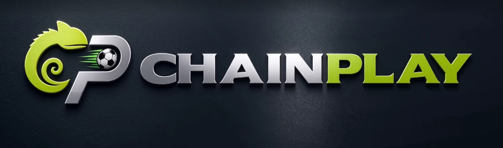

<p align="center">
  
</p>

<h1 align="center">ChainPlay Wiki</h1>

<p align="center">
  Everything about the project in one place: the product, the games, the TxLINE
  integration, the Solana program, security and how to run it.
</p>

---

## 🧭 Start here

| If you are… | Read |
|---|---|
| **A hackathon judge** with 5 minutes | [Main README](../README.md) → [Technical & Integrations Deep Dive](technical-integrations.md) |
| **A new teammate** onboarding | This page top-to-bottom, then [Technical Deep Dive](technical-integrations.md) |
| **Reviewing the smart contract** | [Program README](../program/README.en.md) → [Security review](security-review.en.md) |
| **Curious how the games work** | [The games](#-the-games) below |

---

## 🎮 What is ChainPlay?

ChainPlay turns live World Cup statistics into fast, bettable minigames. Players
predict goals, corners, cards, possession or match outcomes; the server grades every
prediction against **real data from the TxLINE API**, and every bet is escrowed and
settled by our own Solana program (`oddies_bet`, devnet). Each bet mints an **NFT
ticket** — whoever holds the ticket redeems the prize, and the ticket is burned on
redemption.

The two pillars:

- **Verifiable data** — outcomes are anchored to a third-party sports feed, not an
  internal RNG. This is skill/prediction gaming over real sport, not a disguised
  lottery.
- **On-chain settlement** — funds are custodied by a program whose rules neither the
  team nor any player can bend: payouts are public and auditable.

---

## ⚽ The games

The games hub (`#/jogos`) lists 8 minigames on the roadmap; **3 are playable today**.

### 1. Infinite Hi-Lo — `#/hilo-infinito`

*"No fixed target: every correct call climbs one rung of the prize ladder."*

An evolution of classic Hi-Lo: instead of always comparing the same number, each
round draws a **different category** — goals, corners, possession or yellow cards —
and asks whether the next match's value will be **higher or lower** than the
previous one.

- **How to play**: pick only your stake (0.002 / 0.005 / 0.01 SOL) — there is no
  target to lock. Every correct call climbs one rung of a 12-level multiplier
  ladder, from 1.2× up to 28×.
- **The decision on every hit**: keep risking for the next rung, or press
  **CASH OUT** and lock in the current value. A tie (push) doesn't break the streak.
- **Miss without cashing out** = stake lost. **Reach rung 12** = 28×, paid directly
  by the on-chain market.
- **On-chain**: one house-backed market per session (`Market::HouseBacked`), 2
  outcomes (target hit / not hit). The match sequence is generated and validated
  **server-side** — the client never knows the next value before the player commits.
  Cashing out mid-run voids the market (the ticket refunds the stake) and the house
  pays the rung profit instantly. Odds pay below fair statistical value — that
  margin is the house edge.

### 2. 1X2 Markets — `#/mercados`

*"Back the result — home, draw or away."*

A classic parimutuel market on upcoming World Cup fixtures: the pot is split among
whoever gets it right, proportional to stake — no house setting the odds, they
emerge from the community itself.

- **How to play**: pick an open fixture, a stake (0.01 / 0.05 / 0.1 SOL) and a side —
  home (1), draw (X) or away (2). The bet mints an NFT ticket and the SOL joins that
  side's community pot.
- **Live odds**: the % shown on each side derives from the current pot
  (`(total pot + your stake) / (side pot + your stake)`) — it moves as the crowd
  bets.
- **After the match**: winners split the total pot proportionally; redemption happens
  in the Wallet (`#/carteira`). Cancelled match or no winners → market voided,
  everyone recovers their stake.
- **On-chain**: one `Market::Parimutuel` per fixture, created by the backend
  (authority) with 3 outcomes. The platform fee is **10%** per bet, deducted from
  the pot before the split.

### 3. Penalty Predictor — `#/penalty`

*"A World Cup penalty: you have seconds to call it. Goal or save?"*

Lightning mode: whenever a penalty is taken, the player has a short window to
predict the outcome before the kick.

- **Free mode**: simulated penalties, **8 seconds** to pick GOAL or SAVE — saves are
  rare and worth more points; consecutive hits multiply the score. Default mode for
  practice and ranking, no stake.
- **Staked mode**: choose a hit target over a series of 8 kicks (6, 7 or 8 out of
  8) and a stake; sign the bet and answer all 8 within the timer — running out of
  time counts as a miss. Hitting the target pays **1.3×** (6/8), **2.2×** (7/8) or
  **7×** (8/8) straight from the on-chain market.
- **On-chain**: lightning market with a `close_ts` of a few seconds — designed to
  run over TxLINE's live feed in production; demo mode uses simulated penalties.
  The house funds the prize up front and earns the margin over fair value plus the
  stakes of losing sessions.

### Coming soon

Staked Hi-Lo, Guess the Stats, Survivor, Live Challenge and Guess the Team appear in
the hub tagged **"soon"** — game logic and on-chain design are already mapped;
screens are not yet wired to the contract.

### How betting works under the hood

The 3 live games cover both market patterns of the `oddies_bet` contract:

| | Parimutuel (1X2 Markets) | House-backed (Hi-Lo, Penalty staked) |
|---|---|---|
| Counterparty | Other bettors | The house vault |
| Odds | Emerge from the pot | Fixed, locked at bet time |
| House risk | Zero (flat 10% fee) | Bounded by vault liquidity |

In every staked mode the question/answer sequence is generated and validated
**server-side, never in the browser** — the project's anti-fraud golden rule. Every
bet mints an NFT ticket, and redeeming the prize (or the refund, if the market is
voided) always happens in the Wallet using that ticket.

---

## 📡 The TxLINE integration

TxLINE is the sports-data oracle: fixtures and per-match statistics for the World
Cup, with an access model that is itself on-chain (you subscribe by signing a Solana
transaction, then exchange that signature for API credentials).

Highlights of our integration — full detail in the
[Technical & Integrations Deep Dive](technical-integrations.md):

- **Isolated module** ([`server/src/txline/`](../server/src/txline)): nothing else in
  the codebase talks to TxLINE directly.
- **Automated credential lifecycle**: on-chain `subscribe` → JWT → API token, cached
  26 days, with a 15-min cooldown after failures (learned the hard way from devnet
  faucet rate-limits).
- **Reverse-engineered stat schema**: the scores feed encodes stats as
  `(period × 1000) + base_key`; we mapped goals, cards and corners empirically.
- **5-layer resilience**: memory cache → single-flight refresh → failure cooldown →
  disk cache → mock dataset of all 104 fixtures. The product stays demoable through
  a full TxLINE outage.
- **Realtime hub**: server-side polling converted to WebSocket push (`/ws/live`),
  delta-only updates, zero API quota spent while no one is watching.

---

## ⛓️ The Solana program

[`oddies_bet`](../program/README.en.md) (Anchor, devnet
`F4xhKysY8SrNwfqLZxyuJrZCWW8KPVbTjZWb4HHtD4ZA`) is the on-chain cashier: it escrows
stakes, enforces game rules in code and pays winners with no manual step.

- Two market kinds (parimutuel / house-backed) in one program.
- NFT tickets: supply-1 SPL tokens, mint authority revoked, burned on claim — the
  ticket *is* the bet, transferable and sellable, one Collection NFT per game.
- Hardened `initialize` (upgrade-authority-gated), `withdraw_house` capped by the
  `outstanding` counter, orphaned markets auto-cancel into refund mode.
- The backend is the v1 oracle: it reads final scores through the TxLINE resilience
  pipeline and calls `resolve_market` after a post-kickoff grace window.

---

## 🛡️ Security & verification

- [Security review](security-review.en.md) — a 6-pattern Solana vulnerability scan,
  manual economic/state review of the contract, and an adversarial round against the
  API that found and fixed three IDORs — with every fix verified live.
- **e2e against real devnet**: `e2e:full` runs auth → market → bet → resolve → NFT
  claim end to end (30/30 ✅), `e2e:games` plays all 7 games over HTTP and verifies
  every NFT on-chain (40/40 ✅), plus a fuzz suite on the program's invariants.

---

## 🚀 Running the project

```bash
npm run setup   # installs root, server and client deps
npm run dev     # server + client concurrently
```

- Server config (network, credentials): [`server/src/config.ts`](../server/src/config.ts)
- Port 3001 busy? `PORT=<other> npm run dev:server` + `API_PROXY=http://localhost:<other> npm run dev:client`
- TxLINE credentials on read-only hosts: activate locally with `npm run subscribe`,
  then set `TXLINE_JWT` / `TXLINE_API_TOKEN`.

---

## 📚 Full document index

| Document | What's inside |
|---|---|
| [Main README](../README.md) | Product pitch, highlights, TxLINE endpoints, API feedback |
| [Technical & Integrations Deep Dive](technical-integrations.md) | Architecture, TxLINE internals, oracle loop, backend organization |
| [Program README](../program/README.en.md) | The `oddies_bet` program: accounts, instructions, security model, build & deploy |
| [Security review](security-review.en.md) | Contract & API audit: pattern scan, economic review, IDOR findings and fixes, evidence |
