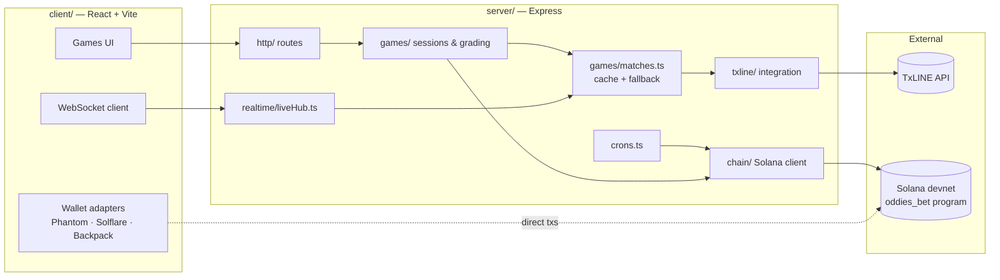
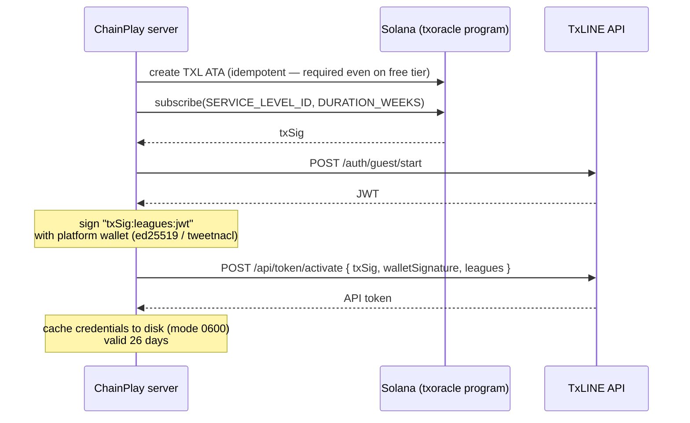

# ChainPlay — Technical & Integrations Deep Dive

This document is the engineering companion to the [main README](../README.md): it
covers, in depth, how ChainPlay integrates with the **TxLINE API** and with
**Solana**, and how the backend is engineered around those two integrations. It is
written for reviewers who want to verify the claims in the README against the actual
code — every section links to the source files that implement it.

---

## 1. System architecture



Two integration boundaries, each isolated behind a single module:

- **[`server/src/txline/`](../server/src/txline)** — the only code that talks to
  TxLINE. Everything else consumes it through `games/matches.ts`.
- **[`server/src/chain/`](../server/src/chain)** — the only code that talks to the
  `oddies_bet` program. Game logic never builds transactions directly.

---

## 2. TxLINE integration

### 2.1 Module layout

| File | Responsibility |
|---|---|
| [`txline/auth.ts`](../server/src/txline/auth.ts) | Full credential lifecycle: on-chain subscription → JWT → API token, caching, cooldowns |
| [`txline/data.ts`](../server/src/txline/data.ts) | Authenticated HTTP client, fixtures/scores snapshots, stat decoding (`extractStats`) |
| [`txline/wallet.ts`](../server/src/txline/wallet.ts) | The platform's Solana keypair used to sign subscription & activation (auto-created, auto-funded on devnet) |

### 2.2 Credential lifecycle (on-chain API subscription)

TxLINE's access model is itself on-chain: you subscribe to a service tier by calling
the `subscribe` instruction of TxLINE's `txoracle` program, then exchange that
transaction signature for API credentials. Our implementation
([`subscribeAndActivate`](../server/src/txline/auth.ts)):



Engineering decisions worth noting:

- **26-day credential cache** (`MAX_AGE_MS`): the guest JWT lasts 30 days and the
  free-tier subscription 4 weeks — we renew with a 2-day safety margin instead of
  re-activating on every boot.
- **15-minute activation cooldown** (`ACTIVATION_RETRY_MS`): activation involves a
  devnet airdrop + an on-chain transaction + two API calls. When it fails (dry
  faucet, API outage), naive retries from every consumer (game service every 5 min,
  crons every 60 s) would hammer the faucet into `429`s — a real incident we hit and
  fixed (recorded in the [security review](security-review.en.md)). After a failure,
  `getCredentials()` throws immediately for 15 minutes instead of re-attempting.
- **Environment-variable injection** (`TXLINE_JWT` / `TXLINE_API_TOKEN`): read-only
  hosts (Vercel) can't write the credential cache, so credentials activated locally
  via `npm run subscribe` can be pasted into the panel and take precedence.
- **Network binding**: cached credentials record which network they were activated on
  and are discarded on mismatch, so switching devnet ↔ mainnet can't reuse stale
  tokens.
- **Wallet management** ([`txline/wallet.ts`](../server/src/txline/wallet.ts)): the
  platform keypair is auto-generated on first run (stored with `0600` permissions, or
  injected via `WALLET_SECRET`), and `ensureFunds` auto-airdrops on devnet / fails
  with a clear message on mainnet.

### 2.3 Data client & endpoints

[`createClient`](../server/src/txline/data.ts) builds an axios instance with both
auth headers (`Authorization: Bearer <jwt>` + `X-Api-Token`) and a deliberate
**10-second timeout** — a degraded TxLINE must not stall a refresh that fans out to
dozens of snapshot calls; the fallback layer (§2.5) covers whatever misses.

| Method | Endpoint | Used for |
|---|---|---|
| `POST` | `/auth/guest/start` | Guest session → JWT |
| `POST` | `/api/token/activate` | On-chain signature → API token |
| `GET` | `/api/fixtures/snapshot` | Match discovery (filtered to World Cup fixtures) |
| `GET` | `/api/scores/snapshot/:fixtureId` | Score/stats source of truth for grading & settlement |

### 2.4 Stat decoding (`extractStats`)

The scores snapshot encodes statistics as numeric keys, `(period * 1000) + base_key`,
with no public schema. We reverse-engineered the mapping by comparing snapshots
against real match scores:

| Base key | Stat |
|---|---|
| `1` / `2` | Goals P1 / P2 |
| `3` / `4` | Yellow cards |
| `5` / `6` | Red cards |
| `7` / `8` | Corners |

[`extractStats`](../server/src/txline/data.ts) is deliberately defensive: it sorts
messages by `seq` and takes the latest, searches the nested per-sport payload
tolerantly for the `stats` map and `possession` object (accepting
`participant1`/`p1`/`"1"` key variants), and coerces every value through
`Number.isFinite` before trusting it. Match state comes from `clock.statusId`
(states `5`/`10`/`13` = finished / after extra time / after penalties, see
`FINISHED_STATES` in [`games/matches.ts`](../server/src/games/matches.ts)).

One subtlety that bit us early: TxLINE's `Participant1` is **not always the home
team**. `Participant1IsHome` drives an orientation pass that flips every stat pair so
the rest of the codebase can always assume `[home, away]`.

### 2.5 Resilience pipeline

All consumers go through a single entry point,
[`getGameData()`](../server/src/games/matches.ts), which layers five defenses between
the games and the external API:

1. **In-memory cache, 5-min TTL** — the realtime hub can request a shorter
   `maxAgeMs` for fresher data without changing the default.
2. **Single-flight refresh** — concurrent callers (realtime hub, `/matches` route,
   run creation, market crons) share one in-flight Promise instead of firing
   duplicate TxLINE fetches.
3. **Failure cooldown (5 min)** — after a failed refresh, consumers are served the
   stale cache directly instead of re-triggering the full fetch every 45 s.
4. **Disk cache fallback** — the last good TxLINE payload survives restarts.
5. **Mock fallback** — a simulated dataset of all 104 World Cup fixtures
   ([`games/mock.ts`](../server/src/games/mock.ts)) keeps every game demoable even
   with TxLINE fully down. Responses always carry `source: "txline" | "mock"` so the
   UI can tell the difference.

Snapshot fan-out is batched at **concurrency 5** with `Promise.allSettled`, so one
slow fixture neither blocks the batch nor kills the refresh.

### 2.6 Realtime distribution

The free tier exposes REST snapshots only, so
[`realtime/liveHub.ts`](../server/src/realtime/liveHub.ts) converts polling into
push:

- Clients open `ws://…/ws/live` and immediately receive a full `snapshot`, then
  `update` messages containing **only the matches that changed** (per-fixture JSON
  diff).
- The 45-second poll **only runs while clients are connected** — an idle server
  spends zero TxLINE quota.
- A 30-second ping/pong heartbeat terminates dead connections, and hub errors are
  contained so a WebSocket failure can't crash the process.

---

## 3. Solana integration

### 3.1 The `oddies_bet` program

Our own Anchor program (devnet: `F4xhKysY8SrNwfqLZxyuJrZCWW8KPVbTjZWb4HHtD4ZA`) is
the on-chain cashier: it escrows stakes, enforces the game rules in code, and pays
winners without any manual step. Full documentation in the
[Program README](../program/README.en.md); the short version:

- **Two market kinds in one program** — `Parimutuel` (winners split the pot, house
  takes a flat 10% fee, zero house risk) and `HouseBacked` (fixed odds locked at bet
  time; the program rejects any bet the house vault could not pay in the worst
  case).
- **PDA layout** — `Config ["config"]`, `Market ["market", market_id]`,
  `Vault ["vault", market]` (SystemAccount holding the SOL, with a rent buffer that
  is never distributed), `Bet ["bet", market, ticket_mint]`.
- **NFT tickets** — every bet mints an SPL token (supply 1, decimals 0, mint
  authority revoked) to the bettor. The token *is* the bet: transferable, sellable,
  burned on `claim()` so double-redeeming is structurally impossible. Each game has
  its own Collection NFT, giving tickets per-game visual identity.
- **Hardened initialization** — `initialize` can only be called by the program's
  upgrade authority (verified against `program_data`), closing the classic
  "first-caller becomes admin" hole.
- **Withdraw safety** — `withdraw_house` can only take what is *not* committed to
  bettors (an `outstanding` counter locks the rest).

### 3.2 The oracle loop: TxLINE → chain

The backend is the v1 oracle wiring the two integrations together
([`chain/markets.ts`](../server/src/chain/markets.ts)):

1. A cron creates 1X2 markets for upcoming fixtures with `close_ts` = kickoff (bets
   lock when the match starts) and `resolve_after_ts` = kickoff + 2h30
   (`RESOLVE_GRACE_S`) — the program refuses to resolve before the match could
   actually have ended.
2. After the grace window, [`settleFixtureMarkets`](../server/src/chain/markets.ts)
   reads the final score through `getGameData()` (i.e., through the full TxLINE
   resilience pipeline) and calls `resolve_market(winning_outcome)`.
3. Markets that never receive a result are cancelled after a timeout, flipping them
   to refund mode — no pot can be stranded.

The same pattern grades the staked single-player modes: the server generates and
stores the question sequence, checks answers server-side, and settles the run
on-chain ([`chain/runs.ts`](../server/src/chain/runs.ts)).

### 3.3 Anti-fraud invariant

In every staked mode, **the browser never learns the next value before the player
commits**. Sequences are generated and validated exclusively server-side
([`games/stakedSession.ts`](../server/src/games/stakedSession.ts) and friends), and
automated tests assert the secret sequence never leaks through any API response.

---

## 4. Backend organization

Each concern has exactly one home; cross-cutting flows always pass through the owning
module:

```
server/src/
├── txline/     # TxLINE credential lifecycle + data client (§2)
├── chain/      # Solana: program client, markets, runs, tickets, custodial wallets, badges
├── games/      # game sessions & grading + matches.ts (cache/fallback pipeline)
├── http/       # Express: routes/ (one file per domain), middleware, security headers, error mapping
├── auth/       # Google, wallet-signature & session auth + user store
├── realtime/   # WebSocket live hub
├── store/      # JSON-file persistence with atomic writes
├── scripts/    # e2e suites + NFT collection tooling
└── crons.ts    # market creation/settlement + credential renewal schedules
```

The HTTP layer ([`http/routes/`](../server/src/http/routes)) is one router per
domain (`auth`, `game`, `markets`, `runs`, `arcade`, `quiz`, `survivor`, `stats`,
`tickets`, `custodial`, `nft`, `rpc`), with shared middleware for auth, security
headers and error mapping ([`http/errors.ts`](../server/src/http/errors.ts) turns
chain errors into meaningful HTTP statuses — e.g. an underfunded house is a clear
`503`, not a generic `500`).

---

## 5. Verification: tests & audits

- **`e2e:full`** ([`scripts/e2e-full.ts`](../server/src/scripts/e2e-full.ts)) runs
  the complete product loop against **real devnet** — auth, market creation, bets,
  resolution, NFT claim — 30/30 checks passing at the time of writing. Additional
  suites cover individual games (`e2e-games`, `e2e-infinite`, `e2e-penalty`,
  `e2e-run`).
- **Program tests** — [`program/tests/oddies-bet.ts`](../program/tests/oddies-bet.ts)
  covers every instruction path, plus a fuzz suite
  ([`program/tests/z-fuzz.ts`](../program/tests/z-fuzz.ts)) hammering invariants
  (vault can never pay out more than it holds, tickets can't double-claim).
- **Security review** — a 6-pattern Solana vulnerability scan of the contract plus
  a systematic IDOR / error-handling / logging audit of the backend, with fixes
  verified live: [security-review.en.md](security-review.en.md).
